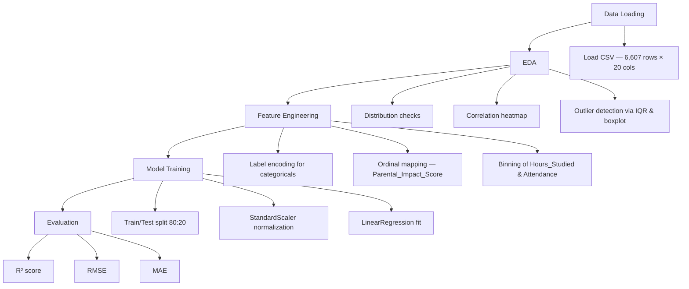

# Student Score Prediction Analysis

<div align="center">


</div>

---

## 📌 Overview

A data science project that explores factors influencing student academic performance and predicts final exam scores using linear regression. The analysis covers exploratory data analysis (EDA), feature engineering, model training, and evaluation on a dataset of 6,607 student records.

---

## 📊 Dataset

- **Source:** [Kaggle – Student Performance Factors](https://www.kaggle.com/datasets/lainguyn123/student-performance-factors/data) (CC BY 4.0)
- **Rows:** 6,607
- **Columns:** 20
- **Target:** `Exam_Score`

| Column | Type | Description |
|--------|------|-------------|
| `Hours_Studied` | Numeric | Weekly hours spent studying |
| `Attendance` | Numeric | Class attendance rate (%) |
| `Sleep_Hours` | Numeric | Average nightly sleep hours |
| `Previous_Scores` | Numeric | Scores from prior assessments |
| `Tutoring_Sessions` | Numeric | Number of tutoring sessions attended |
| `Physical_Activity` | Numeric | Weekly hours of physical activity |
| `Parental_Involvement` | Categorical | Level of parental involvement (Low/Medium/High) |
| `Access_to_Resources` | Categorical | Availability of learning resources |
| `Motivation_Level` | Categorical | Student's self-reported motivation |
| `Internet_Access` | Categorical | Whether the student has internet access |
| `Family_Income` | Categorical | Household income level |
| `Teacher_Quality` | Categorical | Perceived quality of teaching |
| `School_Type` | Categorical | Public or private school |
| `Peer_Influence` | Categorical | Influence of peer group on studies |
| `Learning_Disabilities` | Categorical | Presence of learning disabilities |
| `Parental_Education_Level` | Categorical | Highest education level of parents |
| `Distance_from_Home` | Categorical | Distance from home to school |
| `Gender` | Categorical | Student gender |
| `Extracurricular_Activities` | Categorical | Participation in extracurriculars |
| `Exam_Score` | Numeric | Final exam score (target variable) |

---

## ✨ Analysis Pipeline



---

## 🛠 Tech Stack

| Category | Technology | Purpose |
|----------|-----------|---------|
| Language | Python 3.12 | Core programming language |
| Environment | Jupyter Notebook | Interactive analysis and visualization |
| Data Manipulation | pandas | Data loading, cleaning, and transformation |
| Numerical Computing | NumPy | Array operations and math utilities |
| Visualization | matplotlib | Plotting charts and figures |
| Visualization | seaborn | Statistical visualizations and heatmaps |
| Machine Learning | scikit-learn | Preprocessing, model training, and evaluation |

---

## 📁 Project Structure

```text
score-prediction-analysis/
├── analysis.ipynb                  # Main Jupyter notebook (EDA + modeling)
├── StudentPerformanceFactors.csv   # Raw dataset (6,607 rows)
└── README.md
```

---

## 🚀 Getting Started

**1. Clone the repository**

```bash
git clone https://github.com/vosnuev/score-prediction-analysis.git
cd score-prediction-analysis
```

**2. Install dependencies**

```bash
pip install pandas numpy matplotlib seaborn scikit-learn jupyter
```

> On non-Windows systems, replace `plt.rc('font', family='Malgun Gothic')` in the notebook with a locally available font (e.g., `NanumGothic`) to render Korean axis labels correctly.

**3. Launch the notebook**

```bash
jupyter notebook analysis.ipynb
```

Run all cells from top to bottom in order.

---

## 📈 Results

| Metric | Value | Description |
|--------|-------|-------------|
| R² | — | Proportion of variance in `Exam_Score` explained by the model |
| RMSE | — | Root Mean Squared Error (in score units) |
| MAE | — | Mean Absolute Error (in score units) |

> Exact metric values are computed in the notebook. Key finding: `Attendance` showed the strongest linear correlation with `Exam_Score`, followed by `Hours_Studied`.

**Correlation summary:**

| Correlation Strength | Feature(s) |
|---------------------|------------|
| Strong | `Attendance` |
| Moderate | `Hours_Studied` |
| Weak | `Previous_Scores`, `Tutoring_Sessions` |
| Negligible | `Motivation_Level` (r ≈ 0.08) |

---

## 🎯 Skills Demonstrated

| Skill | Detail |
|-------|--------|
| Exploratory Data Analysis (EDA) | Distribution checks, missing value handling, outlier detection via boxplot and IQR |
| Data Visualization | Correlation heatmaps, scatter plots with regression lines, Pearson r annotation |
| Feature Engineering | Label encoding, ordinal mapping, composite score creation, numeric binning |
| Machine Learning — Regression | Scikit-learn pipeline: `StandardScaler` + `LinearRegression`, train/test split |
| Model Evaluation | R², RMSE, MAE interpretation and reporting |
| Data Cleaning | Capping out-of-range target values (Exam_Score > 100 → 100) |

---

## 📄 License

Dataset: [Kaggle – Student Performance Factors](https://www.kaggle.com/datasets/lainguyn123/student-performance-factors/data) — CC BY 4.0

Project code: MIT License

**References:**
- [scikit-learn LinearRegression docs](https://scikit-learn.org/stable/modules/generated/sklearn.linear_model.LinearRegression.html)
- [seaborn documentation](https://seaborn.pydata.org/)
