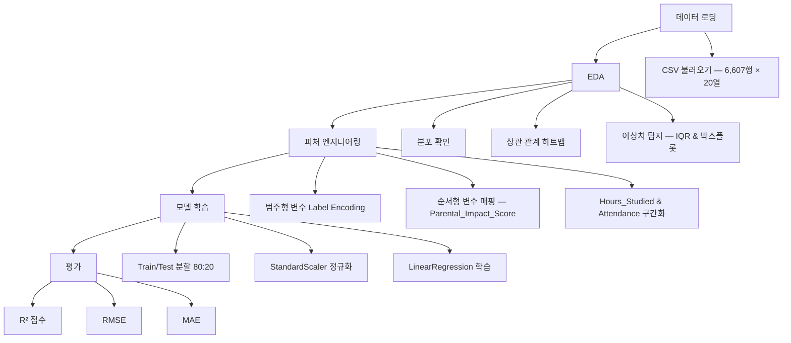

# Student Score Prediction Analysis

<div align="center">


**선형 회귀 모델을 활용한 학생 성적 예측 데이터 분석 프로젝트**

</div>

---

## 📌 개요

학생의 학업 성취도에 영향을 미치는 요인을 탐색하고, 선형 회귀 모델로 최종 시험 점수를 예측하는 데이터 사이언스 프로젝트입니다.

6,607개의 학생 데이터 레코드를 대상으로 EDA(탐색적 데이터 분석), 피처 엔지니어링, 모델 학습, 성능 평가의 전체 분석 파이프라인을 수행합니다.

- **데이터 출처:** [Kaggle – Student Performance Factors](https://www.kaggle.com/datasets/lainguyn123/student-performance-factors/data) (CC BY 4.0)
- **레코드 수:** 6,607행 × 20열
- **예측 목표:** `Exam_Score` (최종 시험 점수)

---

## 📊 데이터셋

| 컬럼명 | 타입 | 설명 |
|--------|------|------|
| `Hours_Studied` | Numeric | 주간 학습 시간 (시간) |
| `Attendance` | Numeric | 수업 출석률 (%) |
| `Sleep_Hours` | Numeric | 평균 수면 시간 (시간/일) |
| `Previous_Scores` | Numeric | 이전 평가 점수 |
| `Tutoring_Sessions` | Numeric | 과외 수업 참여 횟수 |
| `Physical_Activity` | Numeric | 주간 신체 활동 시간 (시간) |
| `Parental_Involvement` | Categorical | 부모의 학습 참여 수준 (Low / Medium / High) |
| `Access_to_Resources` | Categorical | 학습 자료 접근성 |
| `Motivation_Level` | Categorical | 학생의 자기 보고 동기 수준 |
| `Internet_Access` | Categorical | 인터넷 접속 가능 여부 |
| `Family_Income` | Categorical | 가구 소득 수준 |
| `Teacher_Quality` | Categorical | 교사 수업 질에 대한 평가 |
| `School_Type` | Categorical | 공립 / 사립 학교 구분 |
| `Peer_Influence` | Categorical | 또래 집단이 학습에 미치는 영향 |
| `Learning_Disabilities` | Categorical | 학습 장애 유무 |
| `Parental_Education_Level` | Categorical | 부모 최종 학력 |
| `Distance_from_Home` | Categorical | 학교까지의 통학 거리 |
| `Gender` | Categorical | 학생 성별 |
| `Extracurricular_Activities` | Categorical | 과외 활동 참여 여부 |
| `Exam_Score` | Numeric | 최종 시험 점수 (예측 대상) |

---

## ✨ 분석 파이프라인

전체 분석은 데이터 로딩부터 모델 평가까지 5단계로 구성됩니다.

1. **데이터 로딩** — CSV 파일 불러오기 및 기본 구조 확인
2. **EDA** — 분포 확인, 상관 관계 히트맵, IQR 기반 이상치 탐지
3. **피처 엔지니어링** — Label Encoding, 순서형 변수 매핑, 수치 구간화(Binning)
4. **모델 학습** — 8:2 Train/Test 분할, StandardScaler 정규화, LinearRegression 학습
5. **평가** — R², RMSE, MAE 지표 산출 및 해석



---

## 🛠 기술 스택

| 분류 | 기술 | 역할 |
|------|------|------|
| 언어 | Python 3.12 | 핵심 프로그래밍 언어 |
| 개발 환경 | Jupyter Notebook | 인터랙티브 분석 및 시각화 |
| 데이터 처리 | pandas | 데이터 로딩, 정제, 변환 |
| 수치 연산 | NumPy | 배열 연산 및 수학 유틸리티 |
| 시각화 | matplotlib | 차트 및 그래프 생성 |
| 시각화 | seaborn | 통계 시각화 및 히트맵 |
| 머신러닝 | scikit-learn | 전처리, 모델 학습, 성능 평가 |

---

## 📁 프로젝트 구조

```text
score-prediction-analysis/
├── analysis.ipynb                  # 메인 Jupyter Notebook (EDA + 모델링 전체 포함)
├── StudentPerformanceFactors.csv   # 원본 데이터셋 (6,607개 학생 레코드)
└── README.md                       # 프로젝트 소개 문서
```

---

## 🚀 시작하기

**1. 저장소 클론**

```bash
git clone https://github.com/vosnuev/score-prediction-analysis.git
cd score-prediction-analysis
```

**2. 의존 패키지 설치**

```bash
pip install pandas numpy matplotlib seaborn scikit-learn jupyter
```

> Windows 이외의 환경에서는 노트북 내 `plt.rc('font', family='Malgun Gothic')` 부분을 로컬에 설치된 한글 폰트(예: `NanumGothic`)로 변경해야 한글 레이블이 정상 렌더링됩니다.

**3. 노트북 실행**

```bash
jupyter notebook analysis.ipynb
```

셀을 위에서부터 순서대로 모두 실행하세요.

---

## 📈 분석 결과

### 모델 성능 지표

| 지표 | 값 | 설명 |
|------|----|------|
| R² | — | 모델이 `Exam_Score` 분산을 설명하는 비율 |
| RMSE | — | 평균 제곱근 오차 (점수 단위) |
| MAE | — | 평균 절대 오차 (점수 단위) |

> 정확한 수치는 노트북 실행 후 확인할 수 있습니다.  
> 핵심 발견: `Attendance`(출석률)가 `Exam_Score`와 가장 강한 선형 상관 관계를 보였으며, `Hours_Studied`(학습 시간)가 그 뒤를 이었습니다.

### 피처별 상관 관계 요약

| 상관 강도 | 피처 |
|-----------|------|
| 강함 | `Attendance` (출석률) |
| 보통 | `Hours_Studied` (주간 학습 시간) |
| 약함 | `Previous_Scores`, `Tutoring_Sessions` |
| 거의 없음 | `Motivation_Level` (r ≈ 0.08) |

---

## 🎯 습득 기술 및 역량

| 역량 | 세부 내용 |
|------|-----------|
| 탐색적 데이터 분석 (EDA) | 분포 확인, 결측치 처리, IQR 및 박스플롯 기반 이상치 탐지 |
| 데이터 시각화 | 상관 관계 히트맵, 회귀선 포함 산점도, Pearson r 주석 처리 |
| 피처 엔지니어링 | Label Encoding, 순서형 매핑, 복합 점수 생성, 수치 구간화(Binning) |
| 머신러닝 — 회귀 분석 | scikit-learn 파이프라인: `StandardScaler` + `LinearRegression`, Train/Test 분할 |
| 모델 평가 | R², RMSE, MAE 해석 및 결과 보고 |
| 데이터 정제 | 범위 초과 목표값 처리 (Exam_Score > 100 → 100으로 클리핑) |

---

## 📄 라이선스

- **데이터셋:** [Kaggle – Student Performance Factors](https://www.kaggle.com/datasets/lainguyn123/student-performance-factors/data) — CC BY 4.0
- **프로젝트 코드:** MIT License

**참고 자료:**
- [scikit-learn LinearRegression 공식 문서](https://scikit-learn.org/stable/modules/generated/sklearn.linear_model.LinearRegression.html)
- [seaborn 공식 문서](https://seaborn.pydata.org/)
